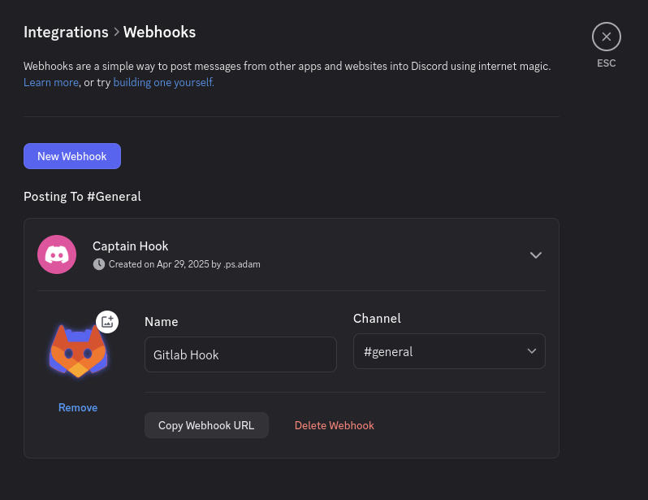
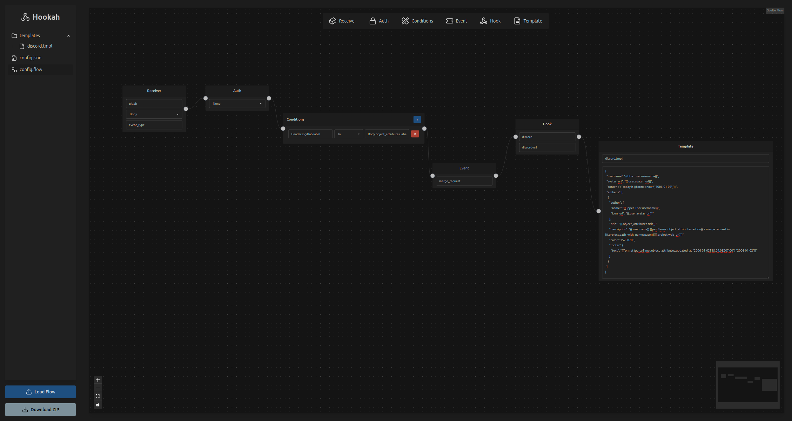
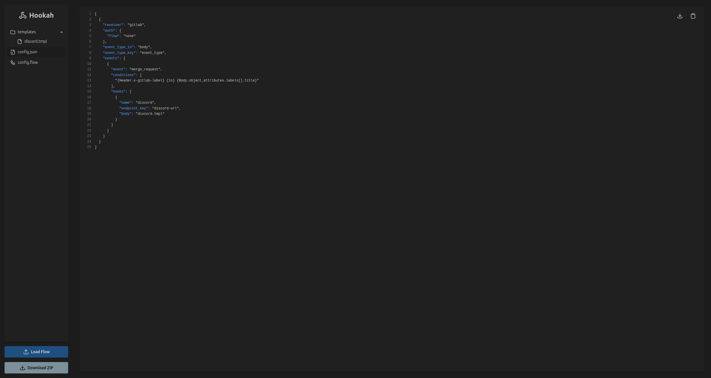
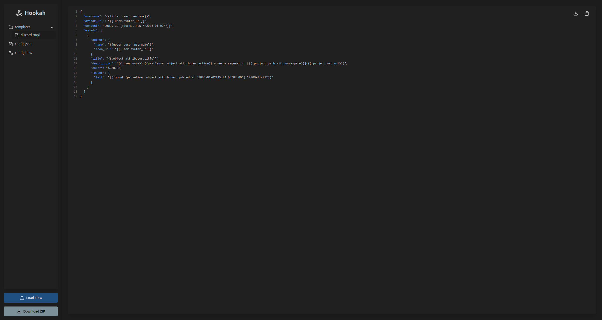

# Quick Introduction

**Hookah** is a lightweight, stateless, zero-dependency **webhook router** written in Go. It acts as a bridge between
webhook sources (like GitLab, GitHub, etc.) and destination targets (such as Discord), forwarding events **only when
they match defined rules**.

### Core Features

- **Webhook Receiver**  
  Accepts incoming webhook requests from various services.

- **Rule Engine**  
  Filters incoming events based on headers, query params, or body fields.

- **Conditional Forwarding**  
  Forwards messages only when all conditions are met.

- **Reusable Templates**  
  Define templates once and reuse them across events.

- **Dynamic Payloads**  
  Compose outgoing requests using data from the incoming payload.

- **Visual UI Config**  
  Use [**hookah-ui**](https://hookah-ui.vercel.app) to build your config visually and export `config.json`,
  `templates`, and editable flows.

## Setting Up a Discord Webhook

Before testing Hookah, you’ll need a Discord webhook to forward events to.

1. Open your Discord server.
2. Navigate to **Server Settings → Integrations → Webhooks**.
3. Click **New Webhook**, give it a name, select a channel, and click **Copy Webhook URL**.

> You’ll use this URL as the value for the `discord-url` query parameter.

### Example Webhook Setup:



## Creating Your Config with hookah-ui

Instead of writing JSON manually, you can use [**hookah-ui**](https://hookah-ui.vercel.app) to visually build your
configuration.

### Steps:

1. Visit [hookah-ui](https://hookah-ui.vercel.app)
2. Add receivers, events, conditions, templates, and webhook targets.
3. Download the ZIP — it includes:
    - `config.json`
    - `templates/` folder
    - `config.flow` (can be imported later for editing)

### Visual Example:

**Flow Editor**


**Config Output**


**Template Output**


## Sample Config (`config.json`)

Below is a basic Hookah config that listens for GitLab `merge_request` events and forwards them to a Discord webhook
**only** if the `x-gitlab-label` matches a label on the MR.

```json
[
  {
    "receiver": "gitlab",
    "auth": {
      "flow": "none"
    },
    "event_type_in": "body",
    "event_type_key": "event_type",
    "events": [
      {
        "event": "merge_request",
        "conditions": [
          "{Header.x-gitlab-label} {in} {Body.object_attributes.labels[].title}"
        ],
        "hooks": [
          {
            "name": "discord",
            "endpoint_key": "discord-url",
            "body": "discord.tmpl"
          }
        ]
      }
    ]
  }
]
```

## Example Template (`templates/discord.tmpl`)

This template formats the GitLab merge request event into a rich embed for Discord.

```json
{
  "username": "{{title .user.username}}",
  "avatar_url": "{{.user.avatar_url}}",
  "content": "today is {{format now \"2006-01-02\"}}",
  "embeds": [
    {
      "author": {
        "name": "{{upper .user.username}}",
        "icon_url": "{{.user.avatar_url}}"
      },
      "title": "{{.object_attributes.title}}",
      "description": "{{.user.name}} {{pastTense .object_attributes.action}} a merge request in [{{.project.path_with_namespace}}]({{.project.web_url}})",
      "color": 15258703,
      "footer": {
        "text": "{{format (parseTime .object_attributes.updated_at \"2006-01-02T15:04:05Z07:00\") \"2006-01-02\"}}"
      }
    }
  ]
}
```

## Running Hookah with Docker Compose

Spin up Hookah quickly using Docker:

```yaml
version: "3.8"
services:
  hookah:
    image: adamiscool/hookah:v0.0.1
    ports:
      - "3000:3000"
    environment:
      PORT: 3000
      CONFIG_PATH: /etc/hookah/config.json
      TEMPLATES_PATH: /etc/hookah/templates
    volumes:
      - ./config.json:/etc/hookah/config.json:ro
      - ./templates:/etc/hookah/templates:ro
    restart: unless-stopped
```

Start it with:

```bash
docker compose up -d
```

## Test It with `curl`

You can simulate a GitLab webhook using the following `curl` command:

```bash
curl -X POST http://localhost:3000/webhooks/gitlab?discord-url=YOUR_DISCORD_WEBHOOK_URL \
  -H "Content-Type: application/json" \
  -H "x-gitlab-label: API" \
  -d '{
    "object_kind": "merge_request",
    "event_type": "merge_request",
    "user": {
      "name": "Administrator",
      "username": "root",
      "avatar_url": "http://www.gravatar.com/avatar/e64c7d89f26bd1972efa854d13d7dd61?s=40&d=identicon"
    },
    "project": {
      "web_url": "http://example.com/gitlabhq/gitlab-test",
      "path_with_namespace": "gitlabhq/gitlab-test"
    },
    "object_attributes": {
      "title": "MS-Viewport",
      "updated_at": "2013-12-03T17:23:34Z",
      "labels": [
        {
          "title": "API",
          "description": "API related issues"
        }
      ],
      "action": "open"
    }
  }'
```

Replace `YOUR_DISCORD_WEBHOOK_URL` with the actual URL you copied from Discord.
